# Azure DevOps Pipeline Monitoring - Add On

## Introduction

As discussed in past blog articles (<a href="https://www.kerski.tech/bringing-dataops-to-power-bi-part22/" target="_blank">Part 22</a> and <a href="https://www.kerski.tech/bringing-dataops-to-power-bi-part25/" target="_blank">Part 25</a>), integrating source code with Azure DevOps yields significant benefits, including the ability to trigger pipelines for evaluating, testing, and deploying code to Power BI workspaces. This integration streamlines development and deployment processes, enhancing collaboration and version control for Power BI projects. 

However, as Git integration moves into general availability and more developers begin using Azure DevOps pipelines, monitoring becomes a greater priority.  The following instructions show how to implement pipeline monitoring with a Power BI dataflow and how to integrate it with the Power BI monitoring template.

## Table of Contents

1. [Introduction](#Introduction)
1. [Prerequisites](#Prerequisites)
1. [Installation](#Installation)
    1. [Setting Dataflow Credentials](#Setting-Dataflow-Credentials)
    1. [Adding Issues to Monitoring](#Adding-Issues-to-Monitoring)
    1. [Setting Expectations for Scheduled Dataflow](#Setting-Expectations-for-Scheduled-Dataflow)
    1. [Extending the PAT Token](#Extending-the-PAT-Token)
    1. [Earlier Versions of Monitoring Template](#Earlier-Versions-of-Monitoring-Template)

## Prerequisites

- <a href="https://docs.microsoft.com/en-us/powershell/scripting/install/installing-powershell-on-windows?view=powershell-7.2" target="_blank">PowerShell 7</a> installed. If you are using Windows 10 or 11, this should be installed already.
- Access to a Power BI Workspace

## Installation

The installation process performs two main tasks:

1) It uploads the template dataflow for Azure DevOps Pipeline Monitoring to the workspace you indicate.
2) It creates a Personal Access Token with build and release read permissions, so that it can be used in setting the credentials for the dataflow.

### Instructions

1. Open PowerShell Version 7 and enter the following script:
   > Invoke-WebRequest -Uri "https://github.com/kerski/pbi-dataops-monitoring/raw/development/scripts/Setup-AzureDevOpsTemplate.ps1" -OutFile "./Setup-AzureDevOpsTemplate.ps1"

1. This will download the setup scripts to the current folder. Run ".\Setup-AzureDevOpsTemplate.ps1" in PowerShell.

1. During the install process you will be prompted to enter the following information:

   - The name of the workspaces you wish to upload the dataflow.
   - The URL of the Azure DevOps project.

   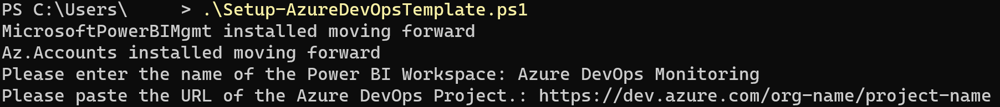
   <em>Figure 1 - Prompts for Installation</em>

1. During the course of the install you will be prompted to enter your Microsoft 365 credentials. Depending on your environment you may have a browser tab appear to sign-in. After signing in you can return to the PowerShell window. In addition, if you don't have the Power BI Management Shell or Az.Accounts installed, you will be asked to install. Please affirm you wish to install those packages if prompted.

1. If the script runs successfully you will be presented with a message similar in the image below.

   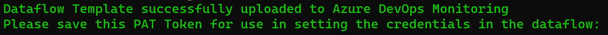

   <em>Figure 2 - Example of Successful Install Message</em>

1. <strong><u>Please save the token for use in the steps below. This will not be accessible once the PowerShell window is closed.</u></strong>

#### Setting Dataflow Credentials

1. Navigate to the workspace you indicated in step 3 above and click on the dataflow name.

   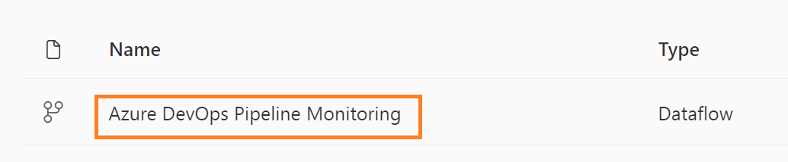
   
   <em>Figure 3 - Open Dataflow</em>

2. Click on the dataflow and choose the "Edit Tables" option.

   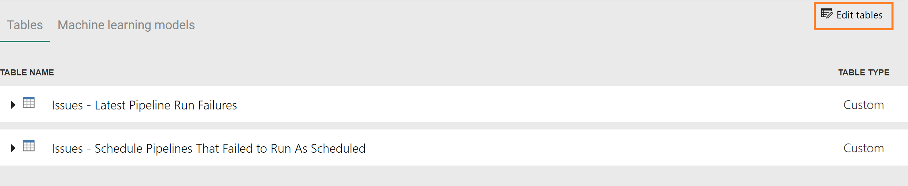
   
   <em>Figure 4 - Edit Tables within Dataflow</em>

3. You will see a prompt to "Configure Connection". Please select.

   
   
   <em>Figure 5 - Configure Connection to Azure DevOps</em>

4. A pop-up will appear, and please choose the "Edit Connection" option.

   
   
   <em>Figure 6 - Edit Connection to Data Source</em>

5. Paste the PAT Token you copied into the password field. Do NOT enter anything into the user field.

   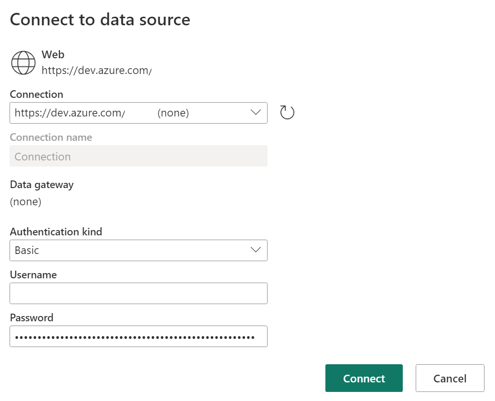 
   
   <em>Figure 7 - Add PAT Token to Password Field</em>

6. Press Connect when finished.

7. If the credentials were created and copied correctly, you can navigate to the tables in the Bronze folder and see the results.

   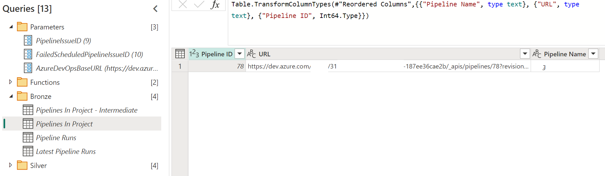
   
   <em>Figure 8 - Example of Successful Loading of Tables</em>

8. Press "Save & Close" to save the changes.

   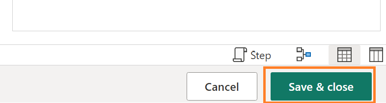
   
   <em>Figure 9 - Save and Close the Changes</em>

9. After saving has completed, you will be prompted to Refresh the dataflow. Press the "Refresh now" button.

   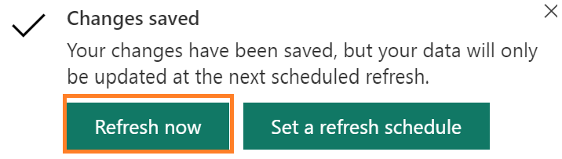 
   
   <em>Figure 10 - Refresh the Dataflow after Saving</em>

10. Remember to schedule the dataflow to refresh. Please refer to [Microsoft's instructions on configuring the dataflow](https://learn.microsoft.com/en-us/power-bi/transform-model/dataflows/dataflows-configure-consume#configure-a-dataflow) if you are unfamiliar with this process.

11. Once the refresh has completed you can add the issues stored in this dataflow to your PBI Monitoring report (see next section).

#### Adding Issues to Monitoring

1. Setup the pbi-dataops-monitoring template as described in the [main documentation](../README.md).

2. Open your monitoring Power BI file and within Power Query add the tables "Issues - Latest Pipeline Run Failures" and "Issues - Schedule Pipelines That Failed to Run As Scheduled" found in the dataflow. Please refer to [Microsoft's instructions on this process](https://learn.microsoft.com/en-us/power-bi/transform-model/dataflows/dataflows-configure-consume#consume-a-dataflow) if you are unfamiliar with this process.

3. Navigate to the "Issues" table and select the cog icon located next to the Source icon.

   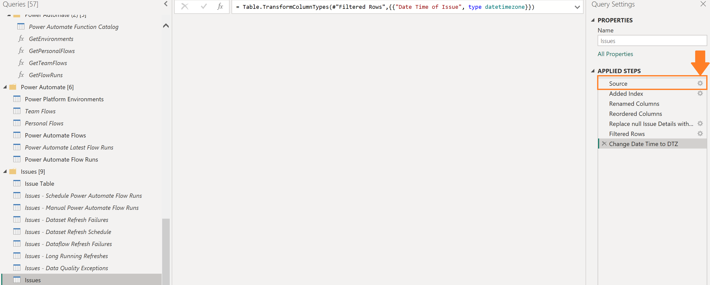
   
   <em>Figure 11 - Update Issues Table's Source Step in Power Query</em>

4. Add the "Issues - Latest Pipeline Run Failures" and "Issues - Schedule Pipelines That Failed to Run As Scheduled" tables to the right side of the pop-up. Press the "Ok" button when complete.

   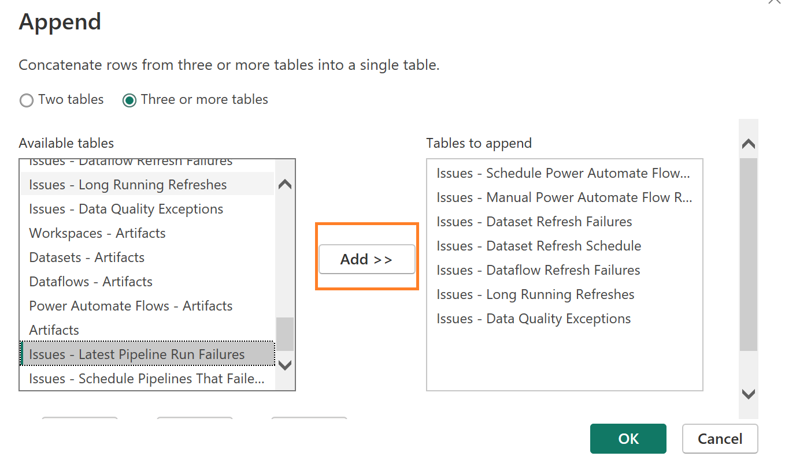
   
   <em>Figure 12 - Append the two new tables added from the Dataflow</em>

5. Close & Apply your changes.

6. Publish your latest changes.

#### Setting Expectations for Scheduled Dataflows

If you have one or more scheduled Azure Pipelines, you can set the expectations for how often these pipelines should run by taking the following steps:

1. In the dataflow, identify the Pipeline ID for the scheduled pipeline with in the "Pipelines In Project" table.

   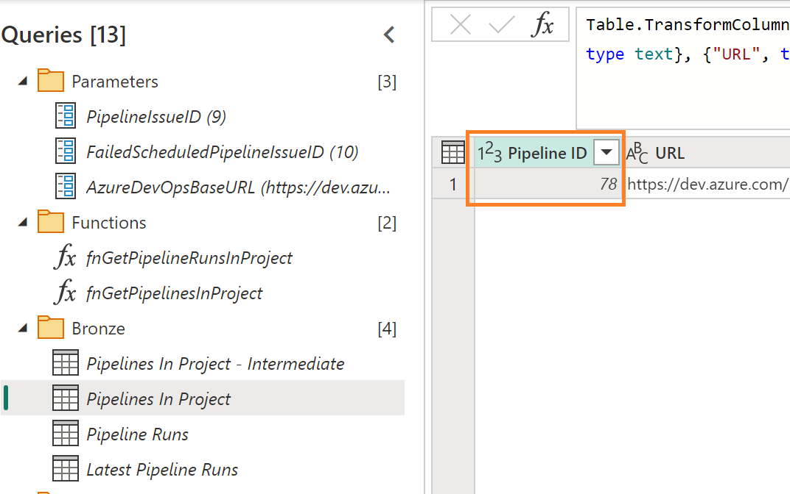 

   <em>Figure 13 - Pipelines in Project table</em>

2. Navigate to the "Schedule Pipeline Expectations" table and click on the cog icon on the Source step.

   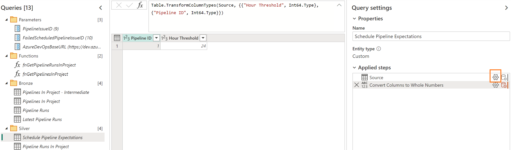

   <em>Figure 14 - Schedule Pipeline Expectations</em>

3. The "Create table" window will appear. Add/Update the Pipeline ID field with the ID you identified in step one and then set the Hour Threshold that will flag the issue. For example in Figure 15, the Hour Threshold is set to 24. Therefore, if the Pipeline ID with the internal ID of 1 will have an issue if it has not run after 24 hours.

4. Press "OK"

   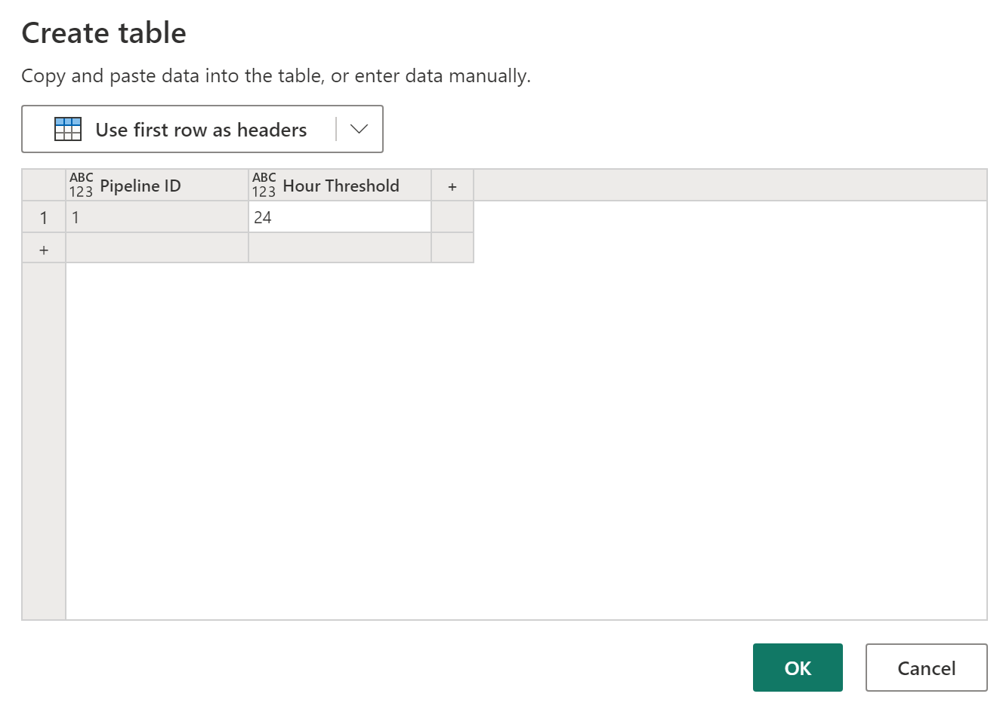 

   <em>Figure 15 - Update the table to set expectations</em>

5. Press "Save & Close" to save the changes to the dataflow.

   

   <em>Figure 16 - Save and Close the Changes</em>

6. After saving has completed, you will be prompted to Refresh the dataflow. Press the "Refresh now" button.

   

   <em>Figure 17 - Refresh the Dataflow after Saving</em>

#### Extending the PAT Token

The current token is scheduled to expire 363 days from when the script was run.

Please be sure to schedule a reminder for 11 months from now to extend the PAT token. For more information on doing that, please [read here](https://improveandrepeat.com/2020/11/how-to-extend-a-personal-access-token-for-azure-devops/).

#### Earlier Versions of Monitoring Template

1. If you installed a version 1.1 or earlier of the monitoring template, you will also need to copy the "Issues Table" contents from the new template to your existing file. This table contains the images and ids necessary for these issues to become visible in the Power BI visuals.
