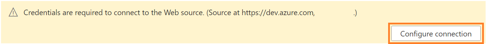
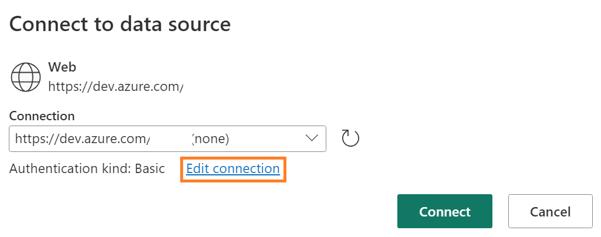

#Azure DevOps Pipeline Monitoring - Add On

## Introduction

{INSERT INTRODUCTION}

## Prerequisites

-  <a href="https://docs.microsoft.com/en-us/powershell/scripting/install/installing-powershell-on-windows?view=powershell-7.2" target="_blank">PowerShell 7</a> installed.  If you are using Windows 10 or 11, this should be installed already.

- Access to a Power BI Workspace

## Installation

The installation process performs two main tasks:

1) It uploads the template dataflow for Azure DevOps Pipeline Monitoring to the workspace you indicate.
2) It creates a Personal Access Token with build and release read permissions, so that it can be used in setting the credentials for the dataflow. 

### Instructions

1. Open PowerShell Version 7 and enter the following script:
    > Invoke-WebRequest -Uri "https://github.com/kerski/pbi-dataops-monitoring/raw/development/scripts/Setup-AzureDevOpsTemplate.ps1" -OutFile "./Setup-AzureDevOpsTemplate.ps1"
    
1. This will download the setup scripts to the current folder.  Run ".\Setup-AzureDevOpsTemplate.ps1" in PowerShell.

1. During the install process you will be prompted to enter the following information:

    - The name of the workspaces you wish to upload the dataflow.
    - The URL of the Azure DevOps project.

    

1. During the course of the install you will be prompted to enter your Microsoft 365 credentials. Depending on your environment you may have a browser tab appear to sign-in. After signing in you can return to the PowerShell window. In addition, if you don't have the Power BI Management Shell or Az.Accounts installed, you will be asked to install.  Please affirm you wish to install those packages if prompted.

1. If the script runs successfully you will be presented with a message similar in the image below.

1. <strong><u>Please save the token for use in the steps below.  This will not be accessible once the PowerShell window is closed.</u></strong>

#### Setting Dataflow Credentials

1.  Navigate to the workspace you indicated in step 3 above and click on the dataflow name.

2.  Click on the dataflow and choose the "Edit Tables" option.

3. You will see a prompt to "Configure Connection".  Please select.

4. A pop-up will appear, and please choose the "Edit Connection" option.

5. Paste the PAT Token you copied into the password field. Do NOT enter anything into the user field.

6. Press Connect when finished.

7. If the credentials were created and copied correctly, you can navigate to the tables in the Bronze folder and see the results.

8. Press "Save & Close" to save the changes.

9. After saving has completed, you will be prompted to Refresh the dataflow.  Press the "Refresh now" button.

10. Once the refresh has completed you can add the issues stored in this dataflow to your PBI Monitoring report (see next section).

#### Adding Issues to Monitoring

1. Setup the pbi-dataops-monitoring template as described in the [main documentation](../README.md).

2. Open your monitoring Power BI file and within Power Query add the tables "Issues - Latest Pipeline Run Failures" and "Issues - Schedule Pipelines That Failed to Run As Scheduled" found in the dataflow. Please refer to [Microsoft's instructions on this process](https://learn.microsoft.com/en-us/power-bi/transform-model/dataflows/dataflows-configure-consume#consume-a-dataflow) if you are unfamiliar with this process.

3. Navigate to the "Issues" table and select the cog icon located next to the Source icon.

4. Add the "Issues - Latest Pipeline Run Failures" and "Issues - Schedule Pipelines That Failed to Run As Scheduled" tables to the right side of the pop-up. Press the "Ok" button when complete.

5. Close & Apply your changes.  

6. Publish your latest changes.

#### Extending the PAT Token
The current token is scheduled to expire 363 days from when the script was ran.

Please be sure to schedule a reminder for 11 months from now to extend the PAT token.  For more information on doing that, please <a href="https://improveandrepeat.com/2020/11/how-to-extend-a-personal-access-token-for-azure-devops/">read here.</a>

### Earlier Versions of Monitoring Template
1. If you installed a version 1.1 or earlier of the monitoring template, you will also need to copy the "Issues Table" contents from the new template to your existing file.  This table contains the images and ids necessary for these issues to become visible in the Power BI visuals.
